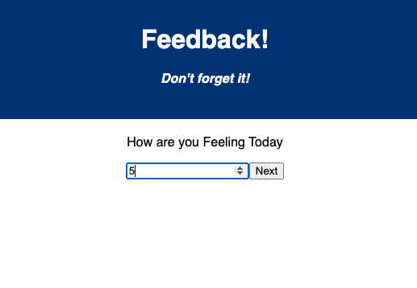
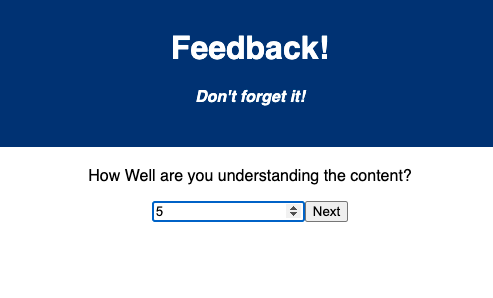
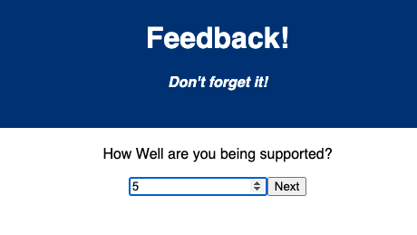
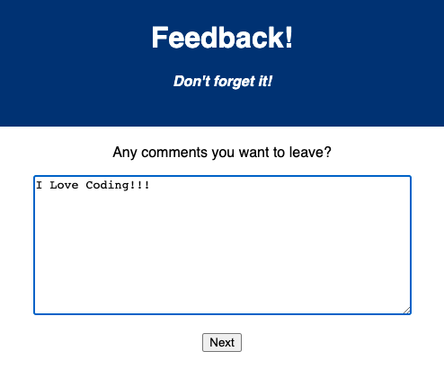
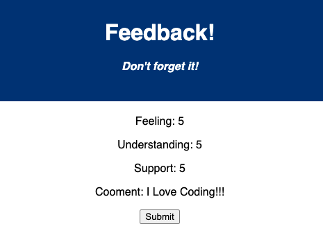
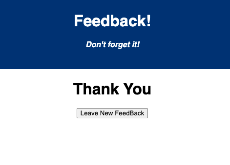

# Project Name

Feedback 

## Description

For this assignment, I will be creating a Reflection/feedback form modeled after Prime's system. Feedback will be collected over 4 views. In a separate review page, display the current feedback values and a submit button.

First page will ask you about how you feel and when you click the next button it'll take you to the next page.

Second page will ask you about your understanding. When you click the next button it'll take you to the next page.

Third page will ask you well you feel supported. When you click the next button it'll take you to the next page.

Fourth page will ask you for additional comments. When you click the next button it'll take you to the next page.

This page will review the rates and comments given. When you click the next button it'll take you to the next page.

Last page will Thank you for your feedback and when button is pressed it'll return back to the first page for new feedback.

